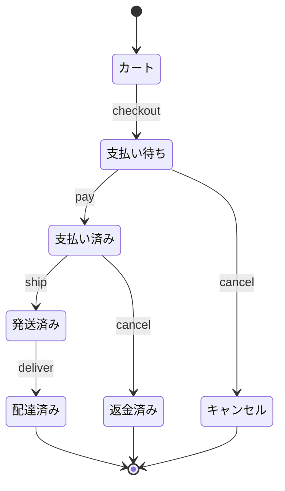

# 注文の状態

カート → 注文確定 → 支払い → 発送 → 配達。支払い前の取り消しはキャンセル、支払い後は返金。

## state: 注文ライフサイクル (1-switch)

```mermaid
stateDiagram-v2
  cart: カート
  pending: 支払い待ち
  paid: 支払い済み
  shipped: 発送済み
  delivered: 配達済み
  cancelled: キャンセル
  refunded: 返金済み

  [*] --> cart
  cart --> pending: checkout
  pending --> paid: pay
  pending --> cancelled: cancel
  paid --> shipped: ship
  paid --> refunded: cancel
  shipped --> delivered: deliver
  delivered --> [*]
  cancelled --> [*]
  refunded --> [*]
```
